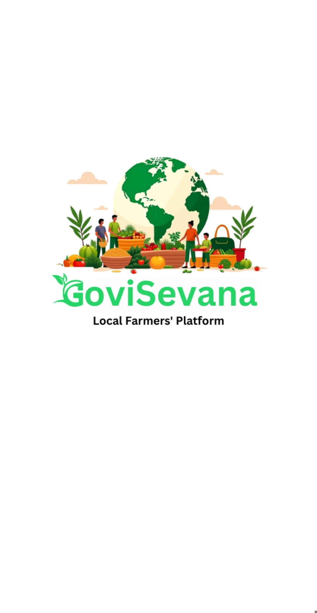
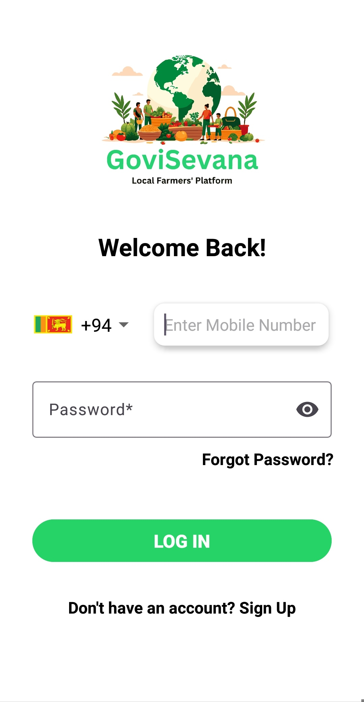
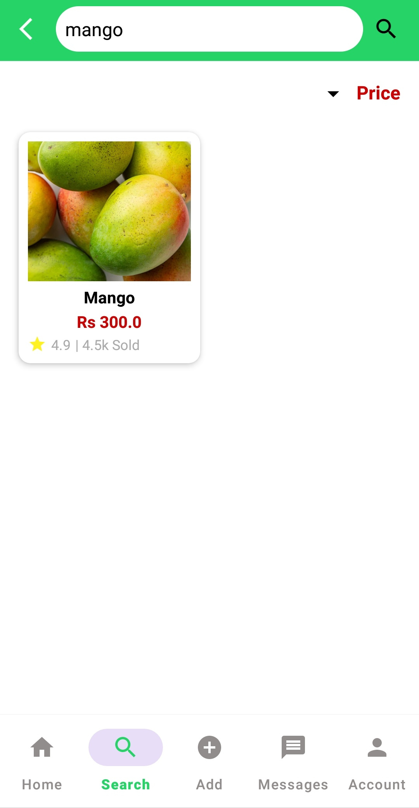
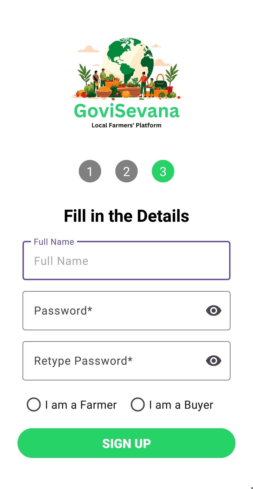
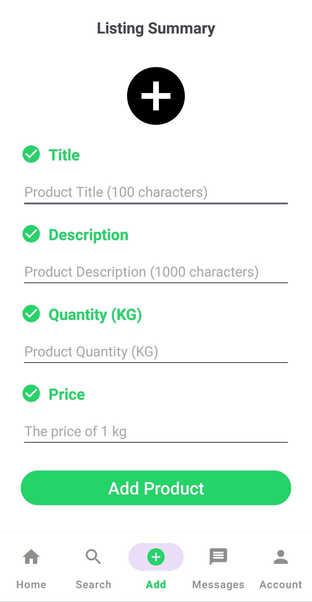
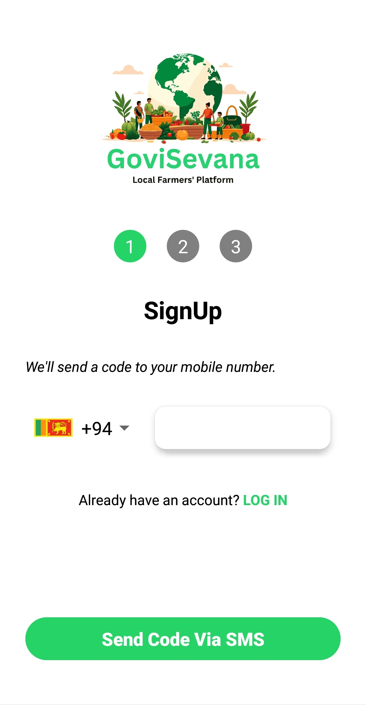
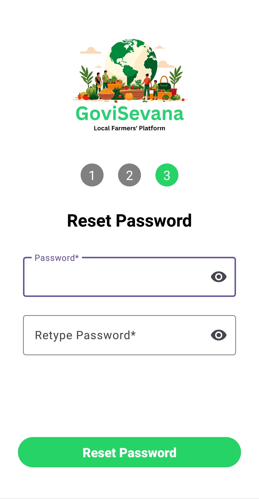
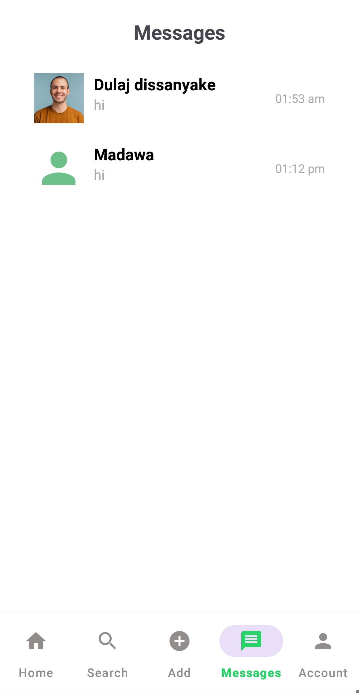

# Govi Sevana - Local Farmers' M-Commerce Platform

**Govi Sevana** is a mobile commerce platform designed to bridge the gap between local farmers and consumers. By providing a direct marketplace, the platform ensures fair pricing for farmers and fresh produce for buyers, eliminating unnecessary intermediaries.

---

## 📱 Features

### 🛒 Buyer App
- **Product Discovery**: Browse and search for fresh agricultural products with ease.
- **Detailed Listings**: View comprehensive product details, including descriptions, prices per KG, and availability.
- **Smart Cart & Checkout**: Add products to your cart and proceed to a secure checkout.
- **Real-time Messaging**: Chat directly with farmers to inquire about products or negotiate deals.
- **Account Management**: Secure login/signup with OTP verification.

### 🚜 Farmer App
- **Product Management**: List new produce with titles, descriptions, images, and pricing.
- **Order Tracking**: Manage incoming orders and track sales.
- **Interactive Dashboard**: Stay updated with the latest activity on your store.
- **Profile Customization**: Manage your farm details and contact information.

### 🔐 Admin App
- **User Oversight**: Manage both farmer and buyer accounts.
- **Marketplace Moderation**: Monitor product listings and ensure quality standards.
- **Order Management**: Track all transactions across the platform.

---

## 🛠️ Tech Stack

- **Frontend**: Native Android (Java & Kotlin)
- **Database**: Firebase Firestore (NoSQL)
- **Authentication**: Firebase Auth (OTP-based)
- **Storage**: Firebase Storage (for product images)
- **Sensors**: Integrated Proximity and Shake sensors for enhanced UX.

---

## 🖼️ UI Showcase

| Splash & Onboarding | Authentication | Dashboard & Products |
| :---: | :---: | :---: |
|  |  |  |
|  |  |  |
|  |  |  |

---

## 🚀 Getting Started

### Prerequisites
- Android Studio (Ladybug or newer recommended)
- Java Development Kit (JDK) 17+
- Firebase Project (google-services.json required)

### Installation
1. Clone the repository.
2. Open the `GoviSevana` folder in Android Studio.
3. Sync the project with Gradle files.
4. Add your `google-services.json` to the `app/` directory.
5. Build and run on an emulator or physical device.

---

## 👥 Contributors
- **Hasith Disanayaka**

---

© 2026 GoviSevana Platform
